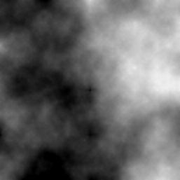
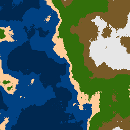

# Procedural Maps Generator

**ProceduralMaps** is a Java program designed to generate maps for video games using a procedural approach. The core algorithm is based on the diamond-square algorithm, as explained in [this informative YouTube video](https://www.youtube.com/watch?v=4GuAV1PnurU&t=619s&ab_channel=KlaytonKowalski).

## Map Generation Process

### Black & White Phase
Initially, the program generates a black and white noise map utilizing the diamond-square algorithm. This phase serves as the foundation for subsequent processing steps:

### Colorizing Phase
The brightness of each pixel in the black and white map signifies a specific height on the terrain, distinguishing between ocean, shore, and land. This phase adds a visual representation to the generated map:

### Smoothing Phase
To address the appearance of isolated pixels with different colors than their neighbors, a smoothing algorithm is applied. This refinement step enhances the overall visual coherence of the map:

### Upscaling Phase
The upscaling method can be invoked at any stage of map creation, doubling the resolution of the preceding phase's map. In the example below, upscaling is performed after all other phases:

## Configuring Special Variables

The ProceduralMaps program allows customization through the adjustment of special variables. The following table provides an overview of the available functions and their effects:

| Function                                        | Effect                                                              |
|-------------------------------------------------|---------------------------------------------------------------------|
| `MapBuilder.setAvgHeight(int height)`           | Sets the average height of the created map.                         |
| `HeightMapBuilder.setRoughness(int roughness)`  | Defines the terrain roughness; lower values result in a flatter map.|

